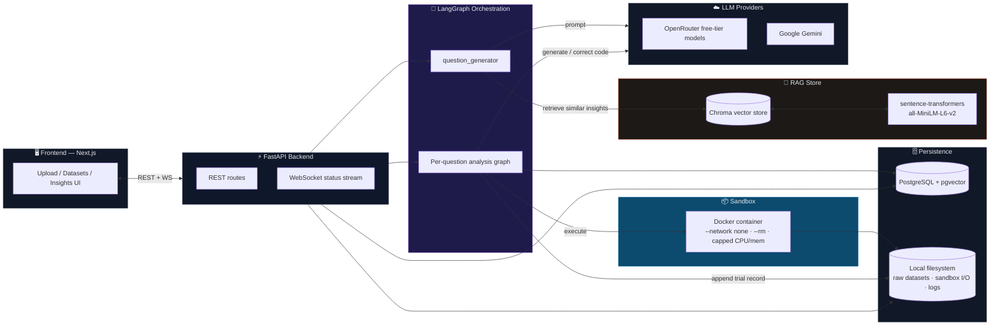
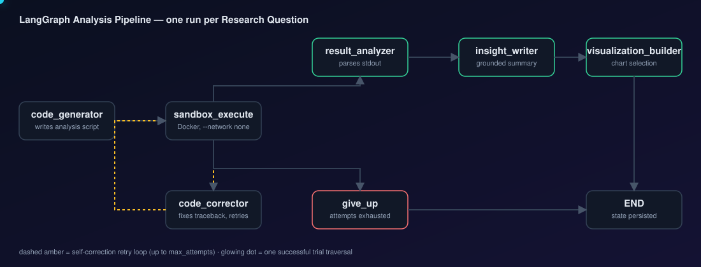
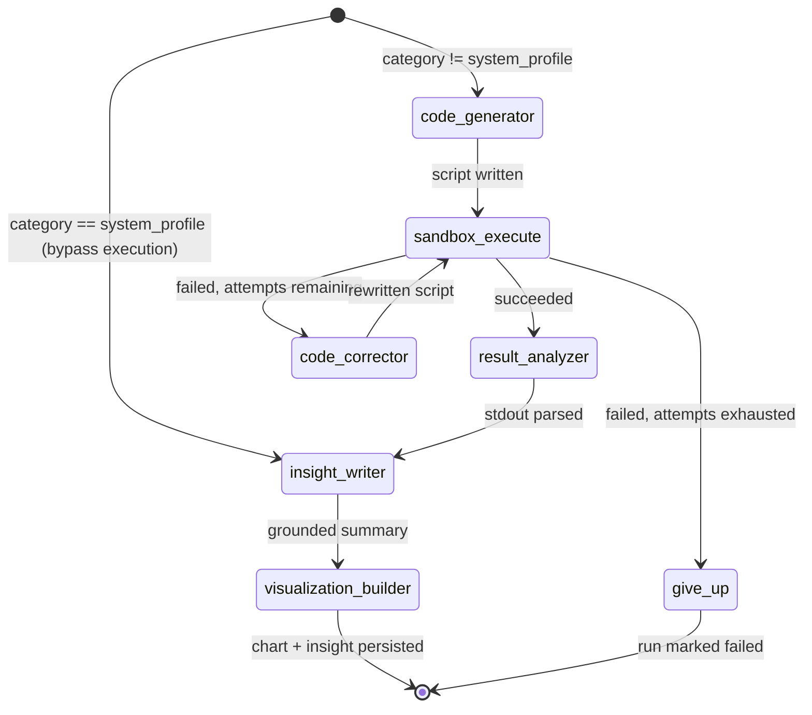
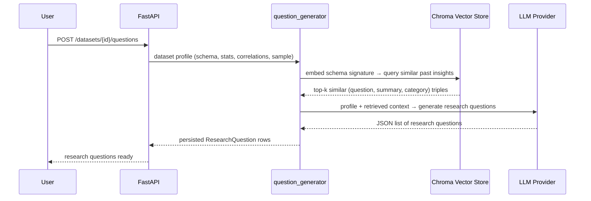
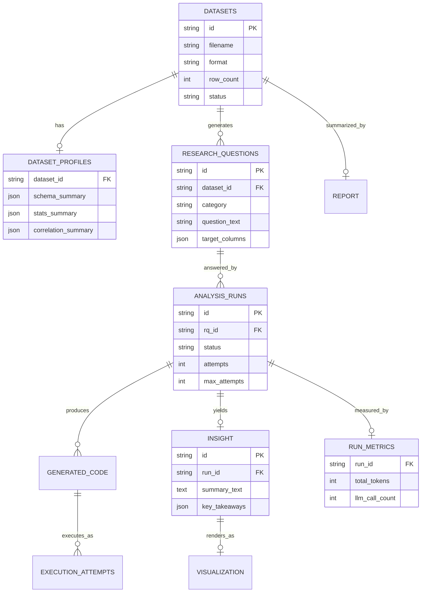

<div align="center">



<br/>

[](#-backend)
[](#-the-analysis-pipeline)
[](#-frontend)
[](#-persistence-layer)
[](#-sandboxed-code-execution)
[](#-retrieval-augmented-question-generation-rag)
[](./LICENSE)

**Upload a dataset. Get back research questions, self-correcting analysis code, grounded insights, charts, and a written report — with no human in the loop.**

</div>

---

## What is DataMind?

DataMind is a **local-first, LLM-orchestrated framework for autonomous exploratory data analysis (EDA)**. Point it at a CSV/JSON/Excel/Parquet dataset and it runs the entire analyst workflow end to end:

1. **Profiles** the dataset (schema, nulls, distributions, correlations) — deterministically, with pandas.
2. **Proposes research questions worth asking**, using an LLM grounded in that profile and (optionally) *retrieved context from similar past datasets it has analyzed before*.
3. **Writes Python analysis code** for each question, executes it inside an isolated, network-disabled Docker sandbox, and **self-corrects on failure** — reading the traceback and rewriting the script, up to a configurable retry budget.
4. **Turns the raw execution output into a grounded, human-readable insight** — no invented numbers, every claim traceable back to what the code actually printed.
5. **Builds a chart** where one belongs, and finally **assembles everything into a single narrative report**.

It was built as a research project studying a specific question: *does retrieval-augmented generation measurably improve the relevance and actionability of LLM-generated research questions, and what does that cost in tokens?* Every stage of the pipeline emits structured telemetry so that question is answerable from data, not vibes — see [Evaluation & Research Instrumentation](#-evaluation--research-instrumentation).

<br/>

<div align="center">

<sub>Animated in a browser (GitHub renders raw SVG natively) — packets show a request moving from upload through profiling, orchestration, sandbox execution, and back.</sub>
</div>

---

## Table of Contents

- [Why This Exists](#why-this-exists)
- [Architecture at a Glance](#-architecture-at-a-glance)
- [The Analysis Pipeline](#-the-analysis-pipeline)
- [Retrieval-Augmented Question Generation (RAG)](#-retrieval-augmented-question-generation-rag)
- [Sandboxed Code Execution](#-sandboxed-code-execution)
- [Persistence Layer](#-persistence-layer)
- [Backend](#-backend)
- [Frontend](#-frontend)
- [Evaluation & Research Instrumentation](#-evaluation--research-instrumentation)
- [API Surface](#-api-surface)
- [Getting Started](#-getting-started)
- [Configuration Reference](#-configuration-reference)
- [Project Layout](#-project-layout)
- [Roadmap](#-roadmap)
- [Research Context](#-research-context)

---

## Why This Exists

Manual EDA doesn't scale with the number of datasets a team accumulates, and it gate-keeps on statistical fluency. Most "AI data analyst" demos stop at *generate one chart from one prompt*. DataMind is an attempt to push further on the parts that are actually hard to get right unattended:

- **Grounding** — the LLM never sees raw rows beyond a small sample; every question and insight is anchored to a computed profile, not hallucinated from vibes.
- **Recovery** — generated code fails sometimes. DataMind treats that as an expected state transition (see the retry loop below), not an error path the user has to handle.
- **Isolation** — arbitrary LLM-generated code runs in a `--network none`, resource-capped, `--rm` Docker container. It cannot exfiltrate data or persist beyond its own attempt.
- **Measurability** — every run — successful or not — is logged as a structured trial record, so the research question ("does RAG help, and by how much?") can be answered with paired statistical comparisons instead of anecdotes.

---

## 🏗 Architecture at a Glance



**Everything runs locally except the LLM API calls.** Postgres, the vector store, the sandbox, and the filesystem are all self-hosted — there's no managed cloud dependency to stand this project up beyond an OpenRouter or Google API key.

---

## 🔄 The Analysis Pipeline

Each **Research Question** is answered by an independent run of a compiled **LangGraph** state machine. Question generation itself happens once *per dataset* (not per question) and is a separate entry point — see the RAG section below.

<div align="center">

</div>



| Node | Responsibility | LLM call? |
|---|---|---|
| `code_generator` | Writes a self-contained pandas/matplotlib script for the research question, using only the dataset's schema (never raw data) | ✅ |
| `sandbox_execute` | Runs the script in an isolated Docker container; captures stdout/stderr/exit code/output files | ❌ |
| `code_corrector` | Reads the traceback from a failed attempt and rewrites the script to fix the specific error | ✅ |
| `result_analyzer` | Parses successful stdout into structured findings | — |
| `insight_writer` | Converts findings into a plain-English, numerically-grounded summary + key takeaways | ✅ |
| `visualization_builder` | Selects and binds the right chart type to the insight | — |
| `give_up` | Terminal failure state once the retry budget is exhausted; records the last traceback | ❌ |

The self-correction loop is bounded by `max_attempts` (configurable per run) so a persistently broken generation can't loop forever — it fails cleanly and is logged as a failure with its full traceback, which itself becomes data (see [Failure Taxonomy](#-evaluation--research-instrumentation)).

---

## 🔎 Retrieval-Augmented Question Generation (RAG)

The central research question this project investigates: **does retrieving context from previously analyzed, structurally similar datasets improve the quality of newly generated research questions?**



- **Embedding model:** `all-MiniLM-L6-v2` via `sentence-transformers` — small, CPU-friendly, runs fully offline after first download. No embedding API cost.
- **Store:** Chroma's local persistent client — a folder on disk, no separate server process, no Docker.
- **Similarity signal:** a synthetic "schema text" (column names + dtypes) rather than raw content, so retrieval approximates *"datasets shaped like this one"* without needing dataset-content access.
- **Baseline arm:** the same pipeline with retrieval disabled (`similar_past_insights = []`), so the RAG vs. baseline comparison is a controlled, single-variable swap — everything else about the run is identical.

---

## 📦 Sandboxed Code Execution

LLM-generated code is arbitrary code. DataMind never trusts it:

```
docker run --rm --network none \
  --memory <sandbox_memory_limit> --cpus <sandbox_cpu_limit> \
  -v <script>:/workspace/code.py:ro \
  -v <dataset>:/workspace/data/input.<ext>:ro \
  -v <outputs>:/workspace/outputs:rw \
  datamind-sandbox:latest
```

- **No network access** — the container cannot phone home or exfiltrate anything.
- **`--rm`** — nothing persists in the container between attempts; every attempt starts clean.
- **Resource-capped** — memory and CPU limits prevent a runaway script from starving the host.
- **Host-side wall-clock timeout** — a hang is killed and recorded as a `timed_out` failure, not left running.
- **Dev mode:** a fast in-process subprocess execution mode (`USE_DOCKER_SANDBOX=false`) is available for local iteration; production/paper-experiment runs use the real Docker sandbox.

---

## 🗄 Persistence Layer



Postgres holds everything durable; the local filesystem holds raw dataset files, per-attempt generated code, sandbox output artifacts, and the append-only research telemetry log (`data/logs/trials.jsonl`) — kept deliberately separate from the DB so the paper's analysis scripts can read it without touching the live application state.

---

## ⚙ Backend

**Stack:** FastAPI · SQLAlchemy (async) · PostgreSQL + `pgvector` · LangGraph · Chroma · Docker SDK/CLI · OpenRouter / Google Gemini via a provider-agnostic LLM client with `tenacity`-based retry for free-tier rate limits.

Key modules:

| Path | Responsibility |
|---|---|
| `app/services/storage.py` | Streams uploads to disk, validates type/size |
| `app/services/profiling.py` | Pandas-based schema/stats/correlation/sample profiling |
| `app/services/sandbox.py` | Docker sandbox invocation, timeout enforcement |
| `app/services/llm.py` | Provider-agnostic LLM client + rate-limit retry |
| `app/services/job_bus.py` | In-process pub/sub for live run-status streaming |
| `app/services/telemetry.py` | Structured per-trial JSONL research logging |
| `app/rag/` | Vector store, embedding, and retrieval for question generation |
| `app/agents/` | LangGraph state, nodes, and the compiled pipeline |
| `app/evaluation/` | Offline RQ-quality and code-quality scoring modules for the paper |
| `app/api/` | REST routes: `auth`, `datasets`, `research_questions`, `runs`, `insights`, `reports`, `ws` |

---

## 🖥 Frontend

**Stack:** Next.js · React · TypeScript.

The UI walks the same journey the pipeline runs: upload a dataset → watch profiling and question generation complete → kick off runs per question → watch live status over the WebSocket → browse resulting insights, charts, and the final report.

---

## 📊 Evaluation & Research Instrumentation

DataMind was built to *answer a research question*, not just to work. Every run is measurable:

- **RQ Quality** — column-grounding rate, EDA-category coverage, redundancy, and semantic diversity computed automatically (zero LLM cost); relevance/specificity/actionability scored by a **held-out LLM judge** using a different model/prompt than the generator itself, so the pipeline never grades its own homework.
- **Code Quality** — deterministic static signals (cyclomatic complexity, `.iterrows()` anti-pattern detection, guard-clause presence, backend correctness) *and* a documented 5-dimension rubric (correctness, idiomatic usage, robustness, output clarity, professional style) scored by an LLM judge — reported side by side so one can corroborate the other.
- **Execution Metrics** — first-pass success rate, eventual success rate, mean attempts to success, and a rule-based failure taxonomy (timeout / KeyError / dtype mismatch / malformed JSON / sandbox OOM), all derived directly from the append-only trial log.
- **Cost Metrics** — total tokens and LLM call count per run, captured per trial for a token-cost-per-successful-insight comparison between the RAG and baseline arms.

Every trial — RAG arm or baseline, success or failure — becomes one line in `data/logs/trials.jsonl`, independent of the live Postgres state, so a paired statistical comparison (t-test / Wilcoxon, with confidence intervals) can be run entirely offline against that log.

---

## 🔌 API Surface

| Method | Route | Purpose |
|---|---|---|
| `POST` | `/auth/login` | Local single-user auth (JWT) |
| `POST` | `/datasets` | Upload a dataset, kicks off background profiling |
| `GET` | `/datasets` / `/datasets/{id}` | List / fetch a dataset |
| `GET` | `/datasets/{id}/profile` | Fetch computed profile |
| `POST` | `/datasets/{id}/questions` | Generate research questions (RAG-augmented) |
| `GET` | `/datasets/{id}/questions` | List generated questions |
| `POST` | `/runs` | Start an analysis run for one research question |
| `GET` | `/runs/{id}` | Poll run status |
| `GET` | `/insights/...` | Fetch insights + visualizations |
| `POST` / `GET` | `/datasets/{id}/report` | Build / fetch the aggregated report |
| `WS` | `/ws/datasets/{id}/status` | Live status stream for an in-progress dataset's runs |

---

## 🚀 Getting Started

```bash
git clone https://github.com/sp2736/data-mind.git
cd data-mind

# --- backend ---
cd backend
cp .env.example .env        # fill in DATABASE_URL, an LLM API key, etc.
pip install -r requirements.txt
docker compose up -d        # Postgres
docker build -t datamind-sandbox:latest -f sandbox/Dockerfile .
alembic upgrade head
python -m app.seed
uvicorn app.main:app --reload

# --- frontend (separate shell) ---
cd frontend
cp .env.local.example .env.local
npm install
npm run dev
```

Then open the frontend, upload a dataset, and watch the pipeline run.

---

## 🔧 Configuration Reference

The most relevant `.env` values (see `app/config.py` for the full list):

| Variable | Purpose |
|---|---|
| `DATABASE_URL` | Async Postgres connection string |
| `OPENROUTER_API_KEY` / `GOOGLE_API_KEY` | LLM provider credentials |
| `QUESTION_GENERATOR_MODEL`, `CODE_GENERATOR_MODEL`, `CODE_CORRECTOR_MODEL`, `INSIGHT_WRITER_MODEL` | Per-node model selection |
| `USE_DOCKER_SANDBOX` | `true` for real Docker isolation, `false` for fast local dev execution |
| `SANDBOX_TIMEOUT_SECONDS`, `SANDBOX_MEMORY_LIMIT`, `SANDBOX_CPU_LIMIT` | Sandbox resource caps |
| `RAG_PERSIST_DIR`, `RAG_EMBEDDING_MODEL` | Local vector store location and embedding model |
| `LOGS_DIR` | Where `trials.jsonl` research telemetry is written |

---

## 📁 Project Layout

```
data-mind/
├── backend/
│   ├── app/
│   │   ├── agents/            # LangGraph state, nodes, compiled pipeline
│   │   ├── api/                # FastAPI routers
│   │   ├── db/                  # SQLAlchemy models + session
│   │   ├── evaluation/       # Offline RQ-quality / code-quality scoring
│   │   ├── rag/                  # Vector store + retriever
│   │   ├── services/           # Storage, profiling, sandbox, LLM, telemetry
│   │   └── schemas/           # Pydantic I/O models
│   ├── migrations/           # Alembic
│   └── sandbox/                # Sandbox Docker image
└── frontend/
    └── src/
        ├── app/                  # Next.js routes (upload, datasets, login, home)
        ├── components/     # UI, charts, auth, layout
        └── lib/                    # API client, auth, mocks
```

---

## 🗺 Roadmap

- [ ] Insight-quality evaluation module (numerical faithfulness, takeaway groundedness, readability, caveat coverage)
- [ ] `experiment/run_experiment.py` — paired RAG-vs-baseline trial harness (N reps × 2 arms)
- [ ] `experiment/judge_trials.py` — offline batch judge scoring into `trials_judged.jsonl`
- [ ] Explicit `rq_judge_model` / `code_judge_model` config fields
- [ ] Per-node LLM call/token breakdown in telemetry
- [ ] Rate-limit retry counting for the resilience metric

---

## 📄 Research Context

DataMind is developed as a B.Tech research project studying whether retrieval-augmented generation measurably improves the relevance, specificity, and actionability of autonomously generated research questions over a non-RAG baseline — and what that improvement costs in tokens. Self-correcting sandboxed code execution is a supporting engineering capability that makes the pipeline reliable enough to generate the trial data the comparison depends on.

<div align="center">
<sub>Built locally-first, end to end — Postgres, the vector store, and the sandbox all run on your own machine.</sub>
</div>
